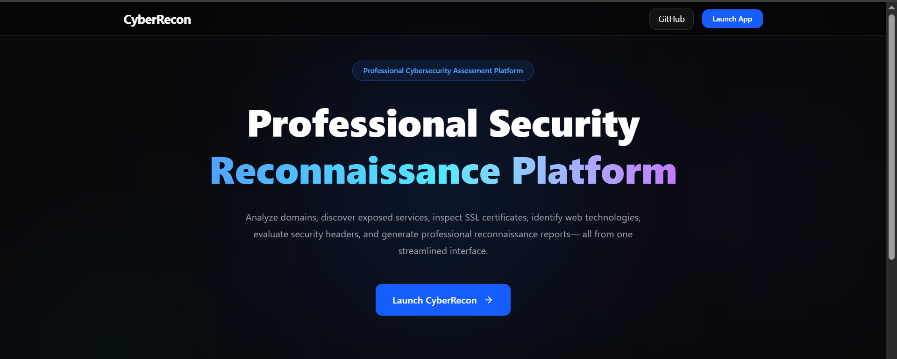
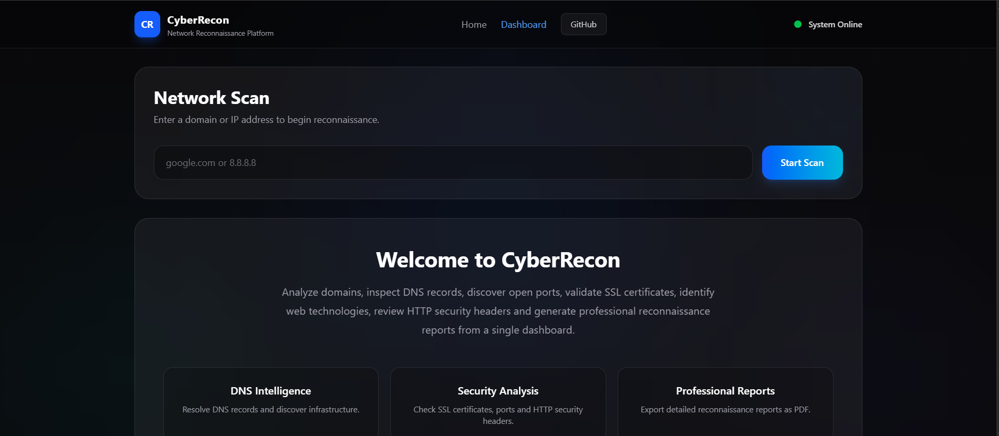

# CyberRecon

A modern network reconnaissance platform built with **React**, **TypeScript**, **Flask**, and **Python** that helps security professionals gather intelligence about public domains and IP addresses through an intuitive web interface.

---

## Preview

### Landing Page



---

### Dashboard



---

### Scan Results


---

### PDF Report


---

## Features

- DNS Lookup
- Port Scanning
- SSL Certificate Analysis
- WHOIS Lookup
- Technology Detection
- Security Header Analysis
- Subdomain Discovery
- Security Findings
- Risk Assessment
- Professional PDF Report Generation
- Responsive User Interface
- Modern Glassmorphism Design

---

## Tech Stack

### Frontend

- React
- TypeScript
- Vite
- Tailwind CSS
- Axios
- Framer Motion

### Backend

- Python
- Flask
- Flask-CORS

---

## Project Structure

```
CyberRecon/
│
├── backend/
│   ├── scanner/
│   ├── app.py
│   ├── report_generator.py
│   └── requirements.txt
│
├── frontend/
│   ├── src/
│   ├── public/
│   └── package.json
│
├── screenshots/
│
└── README.md
```

---

## Installation

### Clone Repository

```bash
git clone https://github.com/ha4saah/CyberRecon.git
```

```
cd CyberRecon
```

---

### Backend

```
cd backend

python -m venv venv
```

Activate the environment

Windows

```
venv\Scripts\activate
```

Install dependencies

```
pip install -r requirements.txt
```

Run Flask

```
python app.py
```

---

### Frontend

```
cd frontend

npm install

npm run dev
```

---

## How It Works

1. Enter a public domain or IP address.
2. CyberRecon validates the target.
3. DNS records are collected.
4. Open ports are scanned.
5. SSL certificates are inspected.
6. Security headers are analyzed.
7. WHOIS information is retrieved.
8. Technologies are detected.
9. Security findings and recommendations are generated.
10. Export the results as a professional PDF report.

---

## Future Improvements

- CVE Lookup
- Geolocation Mapping
- VirusTotal Integration
- Shodan Integration
- SSL Chain Analysis
- Advanced Fingerprinting
- Docker Deployment
- Authentication System

---

## Author

**Hafsa Younis**

GitHub

https://github.com/ha4saah

LinkedIn

https://www.linkedin.com/in/hafsa-younis-00178a330/

---

## License

This project is licensed under the MIT License.